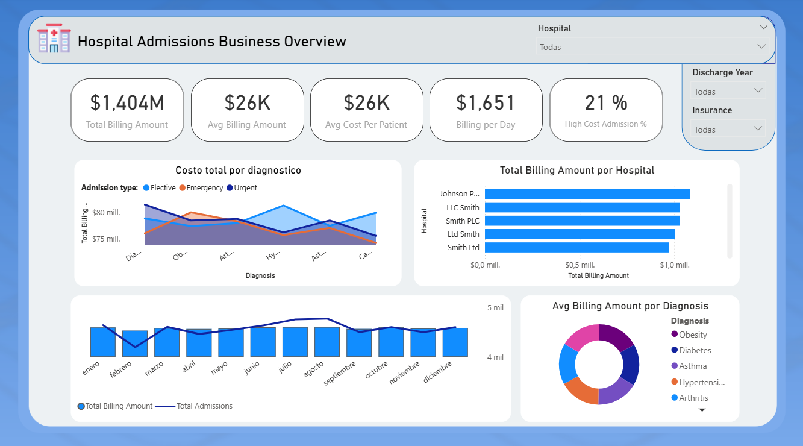
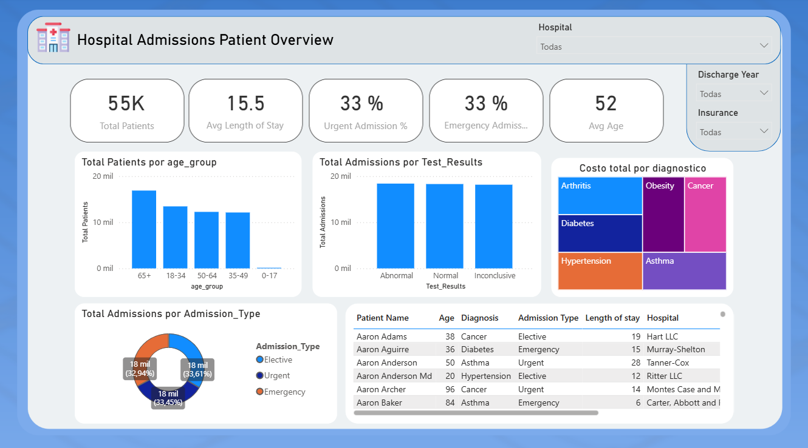

# Hospital Admissions Business & Patient Analysis

End-to-end portfolio project focused on hospital admissions analysis, combining SQL data cleaning, KPI development, Python EDA, SQLite storage, and an interactive Power BI dashboard for business and patient insights.

## Dashboard Preview

### Business Overview


Focused on:

- total billing
- average billing
- billing per day
- average cost per patient
- high-cost admissions
- cost concentration by diagnosis, hospital, and insurance
- monthly admission and billing trends

### Patient Overview


Focused on:

- patient volume
- age groups
- diagnosis frequency
- admission types
- average length of stay
- test results
- patient-level monitoring and operational behavior

## Key Highlights

- 54,860 admissions analyzed
- 54,855 unique patients
- 1.40B total billing amount
- 15.5 average length of stay
- 32.94% emergency admissions


## Project Overview

This project analyzes a healthcare-style hospital admissions dataset to answer two main questions:

1. What is happening from a business and cost perspective?
2. What can we learn from the patient and operational side of admissions?

The workflow was designed with SQL as the core analytical tool, Python for ingestion and exploratory analysis, SQLite as the local database layer, and Power BI for the final dashboard.

## Business Goal

Build a portfolio-ready healthcare analytics project that:

- cleans and structures hospital admission data
- generates operational and financial KPIs
- identifies cost and patient-level patterns
- translates insights into a two-page Power BI dashboard

## Tools Used

### SQL / SQLite
- data cleaning logic
- KPI development
- analytical queries
- filtered views for reporting
- Power BI export preparation

### Python
- CSV ingestion
- SQLite database creation
- deterministic patient ID generation
- exploratory data analysis (EDA)
- validation of duplicates and processed outputs

### Power BI
- interactive dashboard design
- business-focused page for billing and performance
- patient-focused page for demographics, diagnoses, and admissions

## Project Structure

```text
Healthcare-analysis/
├── data/
│   ├── raw/
│   │   └── healthcare_dataset.csv
│   └── processed/
│       ├── clean_admissions_powerbi.csv
│       ├── load_data.py
│       ├── results_analysis.txt
│       └── results_kpis.txt
├── database/
│   └── health.db
├── notebooks/
│   └── eda.ipynb
├── sql/
│   ├── 01_data_cleaning.sql
│   ├── 02_kpis.sql
│   ├── 03_analysis.sql
│   └── 04_powerbi_export.sql
└── README.md
```

## What Was Done With Each Tool

### Python

Python was used to build the database layer and support the exploratory phase.

Main tasks:

- read the raw CSV file from `data/raw/healthcare_dataset.csv`
- create the SQLite database `database/health.db`
- populate the `hospital_admissions` table
- generate a deterministic `Patient_ID` from available patient attributes
- standardize patient names using title case
- perform exploratory data analysis in `notebooks/eda.ipynb`

### SQL

SQL was the analytical core of the project.

#### `01_data_cleaning.sql`

This script creates the `clean_admissions` view and applies:

- null filtering on critical columns
- validation for `Billing_Amount > 0`
- validation for non-negative age values
- date consistency checks
- `length_of_stay` calculation
- `age_group` segmentation

#### `02_kpis.sql`

This script calculates business KPIs such as:

- total patients
- average billing amount
- average length of stay
- total billing amount
- emergency admission percentage
- segmented KPIs by admission type, hospital, insurance provider, and test result

It also includes optional filters by:

- year
- hospital
- insurance provider

#### `03_analysis.sql`

This script explores deeper patterns, including:

- most frequent diagnoses
- cost by diagnosis
- length of stay by age group
- comparisons across admission types
- hospital-level performance
- insurance provider behavior
- test result distribution
- monthly trends

#### `04_powerbi_export.sql`

This export layer was created specifically for reporting in Power BI.

It:

- deduplicates records by `Patient_ID + Admission_Date + Discharge_Date`
- recalculates reporting-ready fields
- formats the output for the final dashboard dataset

## Dataset and Processing Notes

- Raw data was loaded from the original healthcare CSV.
- A deterministic `Patient_ID` was generated because the dataset did not include a native patient key.
- A deduplicated export was created for Power BI to avoid repeated admissions with the same patient and identical admission/discharge dates.
- The final dashboard dataset is stored in `data/processed/clean_admissions_powerbi.csv`.

## Key Metrics

### Final Power BI Dataset

These values correspond to the cleaned and deduplicated dataset used in the dashboard:

- Total admissions: `54,860`
- Unique patients: `54,855`
- Total billing amount: `1,404,121,599.97`
- Average billing amount: `25,594.63`
- Average length of stay: `15.50` days
- Emergency admissions: `32.94%`

### SQL KPI Snapshot

`sql/02_kpis.sql` includes optional filters and was tested with a 2024 slice.

Sample output for that filtered execution:

- Total patients: `3,819`
- Average billing amount: `25,434.91`
- Average length of stay: `15.76` days
- Total billing amount: `97,822,651.58`
- Emergency admissions: `33.31%`

## Main Findings

Some of the strongest insights from the project were:

- Financially, billing is distributed quite evenly across the six main diagnoses, but `Diabetes` leads total billing contribution with more than `236M`.
- `Arthritis`, `Diabetes`, `Hypertension`, `Obesity`, `Cancer`, and `Asthma` all show similar admission volumes, each around `9.1K` admissions.
- The share of emergency admissions stays close to one-third of the total dataset, which suggests a relatively balanced mix of urgent and planned care.
- Average length of stay remains stable around `15.5` days, indicating a relatively consistent hospitalization pattern across the dataset.
- Some of the highest-cost admissions are not the longest ones, which suggests that length of stay alone does not fully explain billing intensity.
- The dashboard confirms that cost concentration can be analyzed from multiple angles: diagnosis, hospital, insurance provider, and admission type.

## Exploratory Data Analysis

The notebook `notebooks/eda.ipynb` covers:

- missing values review
- basic distributions
- outlier detection using IQR
- admission type distributions
- insurance and diagnosis comparisons
- medication and test result exploration
- cost vs. length-of-stay relationships
- extreme-case review
- post-cleaning validation against SQLite outputs

## How to Run the Project

### 1. Create the SQLite database

Run:

```bash
python data/processed/load_data.py
```

This creates:

- `database/health.db`
- table: `hospital_admissions`

### 2. Run SQL cleaning and analysis

Open SQLite and execute the scripts in order:

1. `sql/01_data_cleaning.sql`
2. `sql/02_kpis.sql`
3. `sql/03_analysis.sql`

### 3. Generate the Power BI export

Use:

```sql
.read "C:/Users/ferra/OneDrive/Documentos/Data Projects/Healthcare-analysis/sql/04_powerbi_export.sql"
```

This prepares the processed dataset for the dashboard.

### 4. Open the EDA notebook

```bash
jupyter notebook notebooks/eda.ipynb
```

### 5. Build the dashboard in Power BI

Import:

- `data/processed/clean_admissions_powerbi.csv`

Recommended dashboard structure:

- Page 1: Business Overview
- Page 2: Patient Overview

## Why This Project Matters

This project was built to show an end-to-end analytics workflow that goes beyond simple querying. It combines:

- data ingestion
- data quality control
- SQL analysis
- exploratory analytics
- metric design
- dashboard storytelling

It is intended to demonstrate both technical execution and business-oriented thinking in a portfolio context.

## Notes

- The dataset is synthetic and used for portfolio purposes.
- SQL was intentionally prioritized over Python for business analysis.
- The final Power BI dataset includes a deduplication rule to improve reporting consistency.
# Healthcare-Analysis

